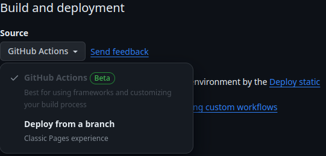

- Превью: https://kseylo.github.io/product-preview-card/
## Установка:

Установка зависимостей
```
pnpm install
```

Запуск
```
pnpm dev
```

## Скриншоты:
### ПК:

### Телефон:

## Технологии которые использовал:
- HTML
- SASS

## Проблемы с которыми столкнулся:
- Использование миксин для построения отзывчивого интерфейса

Решение:
```scss
@mixin desktop() {
    @media screen and (width >= 70em) { // для экранов от 70em
        @content; // содержимое миксины вставляется сюда
    }
}

.card {
    background-color: $white;
    border-radius: 1rem;
    max-width: 20rem;
    display: flex;
    flex-direction: column;

    @include desktop() { 
	    // @content
        flex-direction: row;
        max-width: 34rem;
    }
}
```

- Деплой приложения в github pages, настройка static.yml

Решение:
1. Во вкладке settings/pages в source нужно указать Github Actions, выбрать static content to Pages.



2. Я использовал vite, поэтому мне нужно было создать файл vite.config.js и добавить туда следующий код:

```js
import { defineConfig } from 'vite'

export default defineConfig({
    base: '/product-preview-card/',
})
```

> If you are deploying to `https://<USERNAME>.github.io/<REPO>/` (eg. your repository is at `https://github.com/<USERNAME>/<REPO>`), then set `base` to `'/<REPO>/'`.

3.  создать файл static.yml

```yml
name: Deploy static content to Pages # Название

on:
  push:  # Срабатывает при push'е в ветку main
    branches: ["main"]
  workflow_dispatch:  # Позволяет запускать этот workflow вручную из вкладки Actions

permissions:  # Устанавливает права для GITHUB_TOKEN, разрешая чтение содержимого и запись страниц
  contents: read
  pages: write
  id-token: write

concurrency:  # Устанавливает ограничение на одновременное выполнение и отмену запланированных задач
  group: "pages"
  cancel-in-progress: false

jobs:
  deploy:
    environment:  # Определяет окружение для GitHub Pages
      name: github-pages
      url: ${{ steps.deployment.outputs.page_url }}  # URL страницы после деплоя
    runs-on: ubuntu-latest
    steps:
      - name: Checkout  # Шаг для клонирования репозитория
        uses: actions/checkout@v4
        
      - name: Setup Node  # Установка Node.js
        uses: actions/setup-node@v4
        with:
          node-version: 18
          
      - name: Install pnpm  # Установка pnpm
        uses: pnpm/action-setup@v2
        with:
          version: 8
          run_install: false
          
      - name: Get pnpm store directory  # Получение директории хранилища pnpm
        shell: bash
        run: |
          echo "STORE_PATH=$(pnpm store path --silent)" >> $GITHUB_ENV  # Запись пути в переменную окружения
          
      - name: Setup pnpm cache  # Настройка кэша для pnpm
        uses: actions/cache@v3
        with:
          path: ${{ env.STORE_PATH }}
          key: ${{ runner.os }}-pnpm-store-${{ hashFiles('**/pnpm-lock.yaml') }}
          restore-keys: |
            ${{ runner.os }}-pnpm-store-

      - name: Install dependencies  # Установка зависимостей
        run: pnpm install
        
      - name: Build  # Сборка проекта
        run: pnpm build
        
      - name: Setup Pages  # Настройка Pages
        uses: actions/configure-pages@v3
        
      - name: Upload artifact  # Загрузка artifact'а
        uses: actions/upload-pages-artifact@v2
        with:
          path: './dist'  # Путь к директории с собранным контентом
          
      - name: Deploy to GitHub Pages  # Деплой на GitHub Pages
        id: deployment
        uses: actions/deploy-pages@v2

```